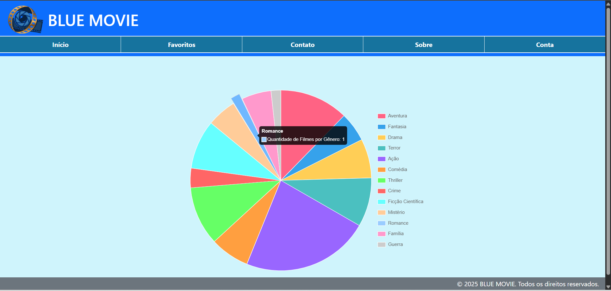
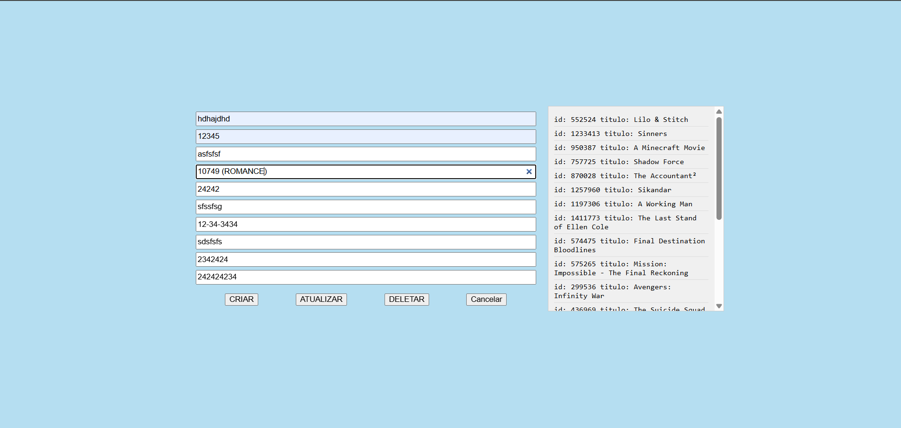
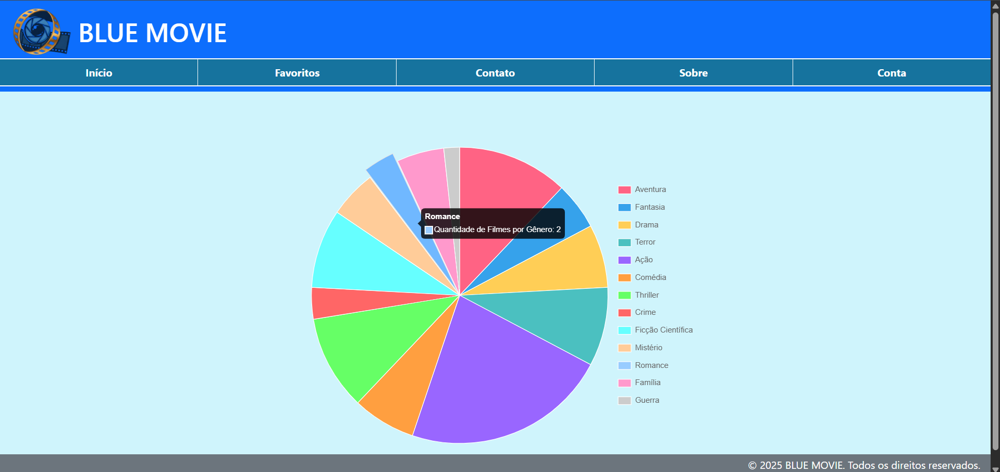

# Trabalho Prático - Semana 14

A partir dos dados cadastrados na etapa anterior, vamos trabalhar formas de apresentação que representem de forma clara e interativa as informações do seu projeto. Você poderá usar gráficos (barra, linha, pizza), mapas, calendários ou outras formas de visualização. Seu desafio é entregar uma página Web que organize, processe e exiba os dados de forma compreensível e esteticamente agradável.

Com base nos tipos de projetos escohidos, você deve propor **visualizações que estimulem a interpretação, agrupamento e exibição criativa dos dados**, trabalhando tanto a lógica quanto o design da aplicação.

Sugerimos o uso das seguintes ferramentas acessíveis: [FullCalendar](https://fullcalendar.io/), [Chart.js](https://www.chartjs.org/), [Mapbox](https://docs.mapbox.com/api/), para citar algumas.

## Informações do trabalho

- Nome: Daniel Gomes pereira
- Matricula: 894057
- Proposta de projeto escolhida: Site de filmes
- Breve descrição sobre seu projeto: É um site que você pode escolher entre diversos filmes que estão em alta e ainda escolher entre os destaques do momento de forma dinamica

**Print da tela com a implementação**

Primeiro, busca-se todos os valores no JSONque chamam genre_ids, a partir de um vetor que diz qual ID representa o respectivo genero (ex: 10749 → Romance). Em seguida, é feita uma contagem de quantos filmes pertencem a cada gênero.
Esses dados são utilizados na API Chart.js, representada pelas linhas dentro desse trecho,

new Chart(ctx, {
});

que é o responsável por criar um gráfico de pizza que mostra a quantidade de filmes por gênero, usando os dados obtidos durante a  execução do código.

